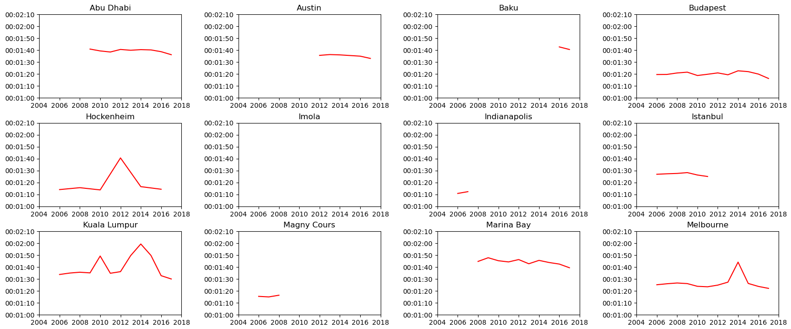
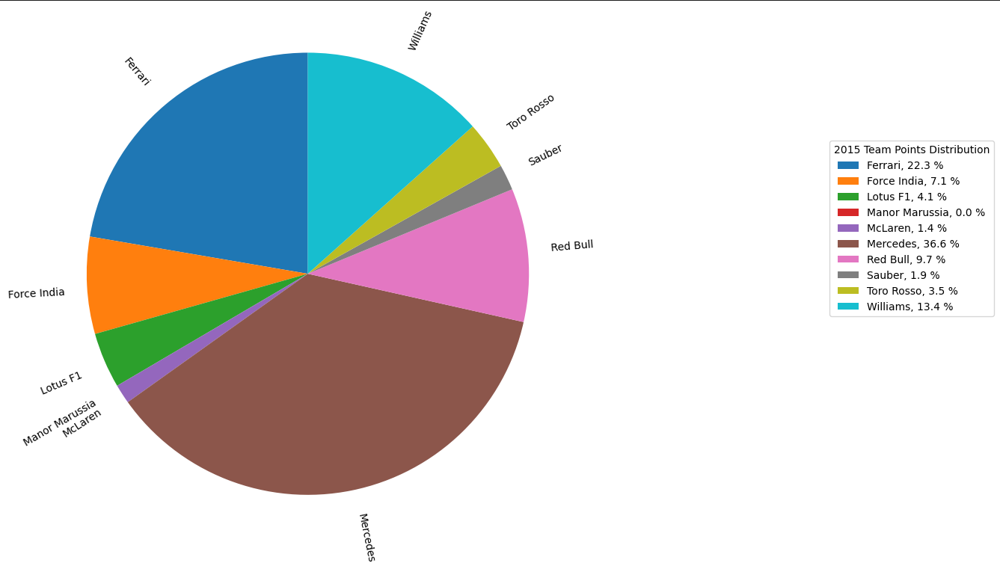

# Formula1DataVisualization

## Datasets
Kaggle URL:https://www.kaggle.com/datasets/cjgdev/formula-1-race-data-19502017

## Section 1 Speed Evolutions
The first section of the project plots line charts displaying the lap times of pole position per circuit from 2004 to 2018.

## Section 2 2017 Driver Comparison
The second section of the project plots a bar chart displaying the amount of time each driver has scored higher scores/places than teammate in 2017.

## Section 3 Constructor Points Distributions
The third section of the project plots pie charts displaying constructors' total point distribution each year from 2014 to 2017.

